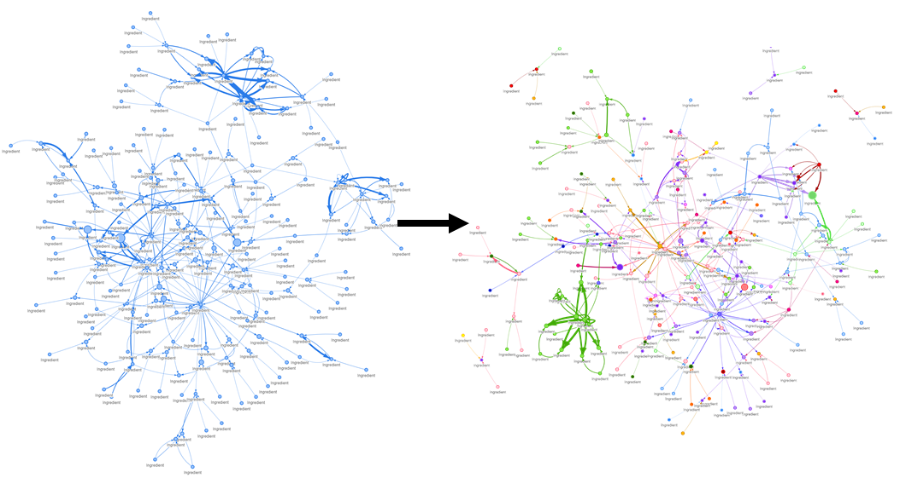
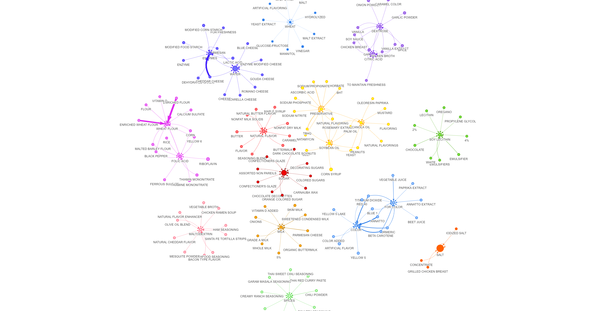

# REU2021
## New Knowledge Extraction Using Graph Databases

## This research was supported by the U.S. National Science Foundation (NSF) under grant CNS-2050925

### Dependencies
- [Food Data Central Database Full Download of All Data Types April 2021](https://fdc.nal.usda.gov/download-datasets.html)
- [Neo4j](https://neo4j.com/)
- [Py2Neo](https://py2neo.org/2021.1/)
- [Neovis.js](https://github.com/neo4j-contrib/neovis.js/)

### Ingredient Breakdown With Dependency Tree

### Graph Database Setup with Node Labels and Relationships

### Browser Display of Query on Garlic

### Browser Display Query on Garlic Powder

### Louvain Community Detection Method

### Community and PageRank Overlayed

### Communities Created Out of 100 Highest Ranked Nodes through PageRank Algorithm

